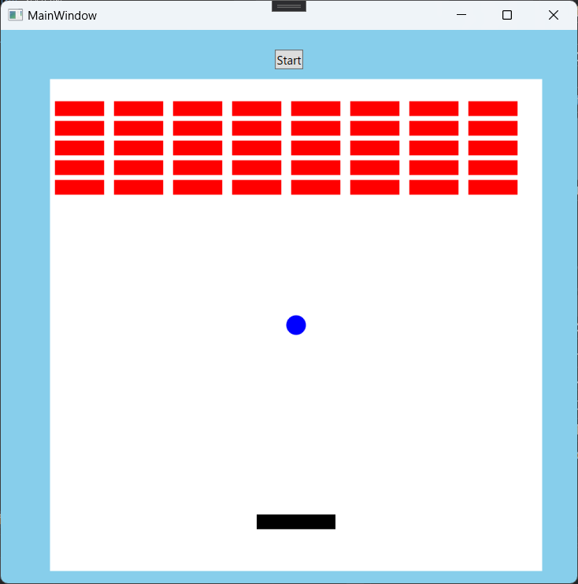

# BreakOut

ChatGPTにC#でWPFのブロック崩しプログラムを作ってもらい、動作しなかったので手動で修正しました。




## GPT3.5Plusに出してもらったUML図

```
UMLを用いた設計の流れ
```
と聞いてから
```
Mermaid形式でブロック崩しのユースケース図を出してください
```
という風に聞いて行きました。

### ユースケース図


### クラス図


### シーケンス図


### アクティビティ図


### コンポーネント図


## 実装もChatGPTにお願いする

Chatが長くなるといろいろと不都合が発生するためNewChatにて、
```
以下のmarmaid形式のクラス図を基にC#でクラスを実装してください。
(先ほどのmarmaid形式クラス図)
```
と入力した後、
```
C#のWPFで実装してみてください。
```
と
```
先ほどのコードに対してのGameクラスを出力してください。
```
で出力されたものをプロジェクトに手動でまとめました。
（ただし、途中で止まってしまうのでその都度、関数〇〇から後の分を出力してくださいと入力）

でも最初は動作しませんでした。

## 手動で修正

### 修正した問題
・イベントハンドラーが巡回<br/>
・別スレッドからUIを操作しているのにTask.Runを使っていない<br/>
・ブロックに反射しない（デフォルトで貫通玉）<br/>
・ゲームエリアとbackgroundが同じ色で区別できない<br/>

### 残っている問題
・めり込むと反射がおかしくなる<br/>

・MVVMに準拠させる（作業中）<br/>
